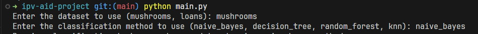

# Intelligent Data Analysis

This repository contains the code for the Intelligent Data Analysis practical project at Instituto Politécnico de Viseu.

## Installing dependencies

This project was developed using Python 3.13.1.
To install the dependencies, run the following command:

```bash
pip install -r requirements.txt
```

## Running

There are two ways of running this project

### Using the interactive menu

You can run the project by simply running the main.py file, and it will prompt you with what dataset and method you want to use.

```bash
python main.py
```

Example:


### Using CLI flags

The project also has two flags that can be used to specify the dataset (`--dataset=` or `-d`) and the method (`--method=` or `-m`).

```bash
python main.py [-h] [-d {mushrooms,loans}] [-m {naive_bayes,decision_tree,random_forest,knn}]
```

Example:

```bash
python main.py --dataset=mushrooms --method=naive_bayes
# or
python main.py -d mushrooms -m naive_bayes
```
